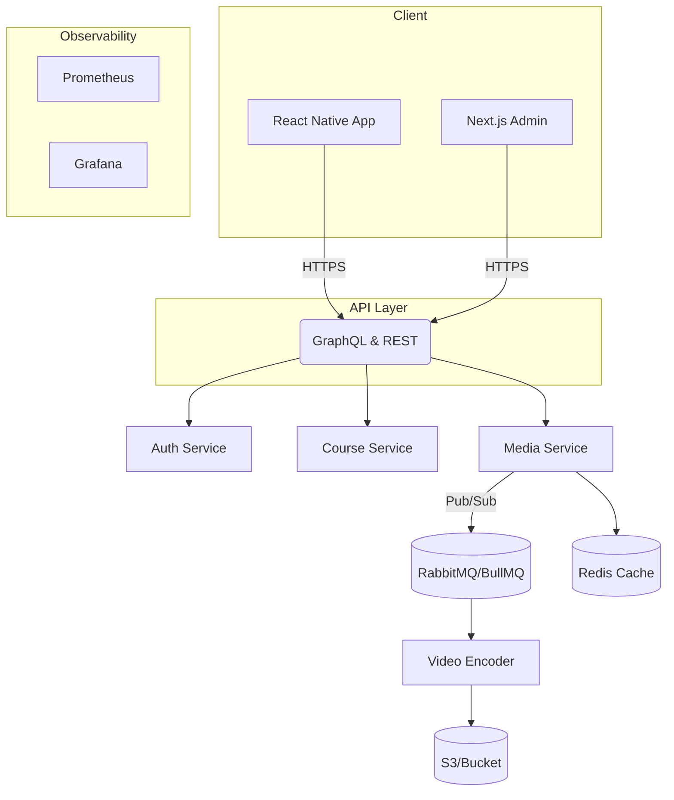

# Krishna Academy — Full‑Stack LMS Suite

> **Table of Contents**
>
> 1. [Overview](#overview)
> 2. [Architecture](#architecture)
> 3. [Demo Links](#demo-links)
> 4. [Tech Stack](#tech-stack)
> 5. [Features](#features)
> 6. [Folder Layout](#folder-layout)
> 7. [Getting Started](#getting-started)
> 8. [Environment Variables](#environment-variables)
> 9. [Running with Docker](#running-with-docker)
> 10. [Scripts & Tasks](#scripts--tasks)
> 11. [Roadmap](#roadmap)
> 12. [Contributing](#contributing)
> 13. [License](#license)

---

## Overview

**Krishna Academy LMS** is an end‑to‑end learning‑management suite that powers [krishnaacademy.in](https://krishnaacademy.in/) and its companion **React Native** mobile app.
The platform delivers low‑latency video, real‑time engagement analytics and iron‑clad anti‑piracy controls while remaining fully offline‑capable.

<p align="center">
  
</p>

## Architecture



## Demo Links

| Service               | URL                                                      |
| --------------------- | -------------------------------------------------------- |
| Production Site       | [https://krishnaacademy.in/](https://krishnaacademy.in/) |
| API Playground        | `https://api.krishnaacademy.in/graphql`                  |
| Admin Panel (staging) | `<add‑url‑here>`                                         |
| Android APK (latest)  | `<add‑url‑here>`                                         |

## Tech Stack

* **Frontend Web:** Next.js 14, React 18, Tailwind CSS, TanStack Query
* **Mobile:** React Native 0.74, Expo Router 2
* **Backend:** Node 18, **NestJS**, Express, GraphQL, REST
* **Database:** PostgreSQL 15, Redis 7
* **Message Queue:** RabbitMQ 3, BullMQ  2
* **Media:** FFmpeg, HLS, AWS S3
* **DevOps:** Docker, Kubernetes (K3s & EKS), GitHub Actions, Terraform, Prometheus, Grafana
* **Auth:** OAuth 2.0 / JWT, Device‑bound tokens

## Features

### Learning

* 📺 Low‑latency adaptive HLS streaming
* 📥 Offline download + granular expiry rules
* 📝 Quizzes, assignments & grading rubrics

### Admin

* 📊 Real‑time KPI dashboard (student presence, watch‑time, drop‑offs)
* 🗄️ Bulk CSV/XLS course importer with validation
* 🎯 Granular RBAC (super‑admin, instructor, TA, student)

### Anti‑Piracy

* 🔒 DRM‑like screenshot & screen‑record blocking (mobile + desktop)
* 📵 Device + SIM binding to prevent account sharing
* 🚨 Live anomaly alerts (webhooks → Slack / e‑mail)

### DevOps

* 🔄 Blue‑green deploys with zero downtime
* 📈 Centralised logging (EFK)
* 🧪 250+ unit/integration tests (Jest + Supertest)

## Folder Layout

```text
.
├─ apps/
│  ├─ admin-web/          # Next.js admin panel
│  └─ mobile/             # React Native app (Expo)
├─ packages/
│  ├─ api-gateway/        # NestJS GraphQL + REST façade
│  ├─ services/
│  │   ├─ auth-service/
│  │   ├─ media-service/
│  │   └─ course-service/
│  └─ libs/               # Shared ts‑libs, eslint, ts‑config
├─ infra/                 # Terraform + Kubernetes manifests
└─ docs/
```

## Getting Started

### 1 · Clone

```bash
git clone https://github.com/youruser/krishna‑academy.git
cd krishna‑academy
```

### 2 · Backend (local)

```bash
cd packages/api-gateway
cp .env.example .env
pnpm i
pnpm dev
```

### 3 · Admin Web

```bash
cd apps/admin-web
cp .env.example .env.local
pnpm i
pnpm dev   # http://localhost:3000
```

### 4 · Mobile (Expo)

```bash
cd apps/mobile
expo start  # use Expo Go or an emulator
```

## Environment Variables

| Key                          | Description                  |         |
| ---------------------------- | ---------------------------- | ------- |
| `DATABASE_URL`               | PostgreSQL connection string |         |
| `REDIS_URL`                  | Redis instance URL           |         |
| `JWT_SECRET`                 | HMAC secret for tokens       |         |
| `AWS_ACCESS_KEY_ID / SECRET` | S3 uploads                   |         |
| `RABBITMQ_URL`               | MQ connection string         |         |
| `ENABLE_PIRACY_GUARD`        | \`true                       | false\` |

See each package’s **`.env.example`** for the complete list.

## Running with Docker

```bash
# Build all images
pnpm docker:build
# Bring up full stack (DB, Redis, RabbitMQ, services, admin)
docker compose up
```

👉 The stack will be live at `http://localhost:3000` (admin) and `http://localhost:4000/graphql` (API).

## Scripts & Tasks

| Command             | Where       | Purpose                        |
| ------------------- | ----------- | ------------------------------ |
| `pnpm test`         | any package | Run Jest unit tests            |
| `pnpm lint`         | root        | ESLint + Prettier              |
| `pnpm dev`          | api‑gateway | Hot‑reload dev server          |
| `pnpm docker:build` | root        | Build multi‑arch Docker images |

## Roadmap

* [ ] **LMS v2**: support SCORM & xAPI packages
* [ ] **iOS app**: native offline DRM
* [ ] **AI tutor**: GPT‑powered Q\&A chat per lesson
* [ ] **WebRTC live classes** with recording & transcripts

## Contributing

1. Fork the repo & create your branch: `git checkout -b feat/amazing`
2. Commit your changes: `git commit -m 'feat: add amazing feature'`
3. Push: `git push origin feat/amazing`
4. Open a PR — we’ll review ASAP 🥳

## License

Distributed under the MIT License — see `LICENSE` for details.
